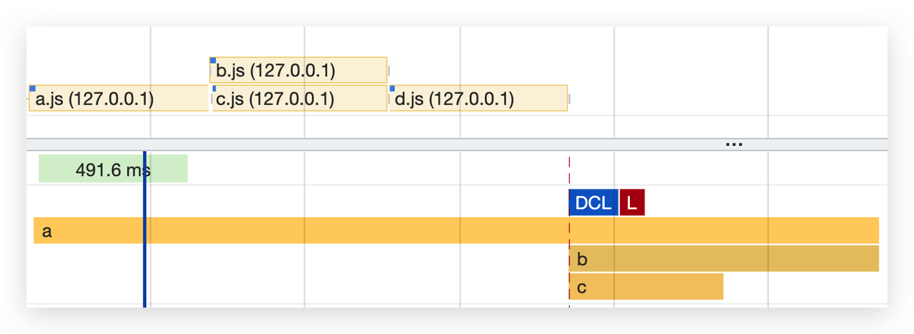
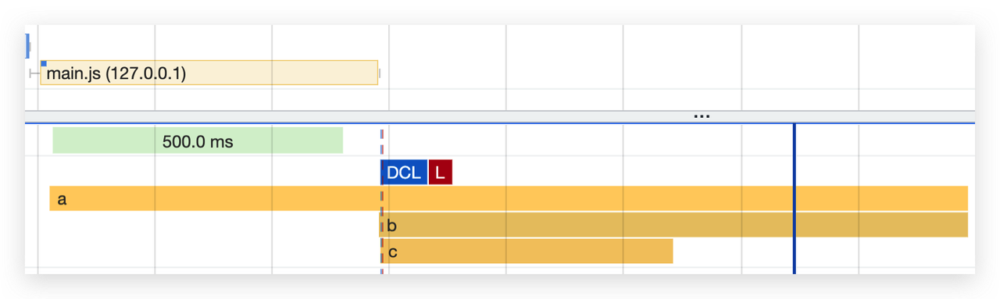

# Top-level-await (TLA)

## Introduction

在 ByteDance 内，我们基于 [Rsbuild](https://github.com/web-infra-dev/rsbuild) 建设的 Mobile Web Framework 的用户遇到了 [Syntax Checker](https://github.com/web-infra-dev/rsbuild/blob/main/packages/document/docs/en/shared/config/security/checkSyntax.md#enable-detection) 问题:

```bash {6-7}
error   [Syntax Checker] Find some syntax errors after production build:

  ERROR#1:
  source - /node_modules/pia-app/esm/utils.js:6:7
  output - /pia/example/kit/dist/resource/js/vendor.505d4345.js:1:32501
  reason - Unexpected token (1:32501)
  code   - async(e,r)=>{try{var t=o(326)

Error: [Syntax Checker] The current build fails due to an incompatible syntax, which can be fixed in the following ways:
```

针对这类问题，我们首先想到的是此问题可能是三方依赖引入的，这是因为 **“构建器出于编译性能的考虑，默认情况下，Builder 不会编译 `node_modules` 下的 JavaScript/TypeScript 文件”**，用户此时可能依赖了一个产物中包含 async/await 的三方依赖，导致最终编译错误。于是，我们建议开发者使用 [source.include](https://modernjs.dev/builder/en/api/config-source.html#sourceinclude) 来 [Downgrade third-party dependencies](https://modernjs.dev/builder/en/guide/advanced/browser-compatibility.html#downgrade-third-party-dependencies):

```ts
import path from "path";

export default {
  source: {
    include: [/\/node_modules\/query-string\//],
  },
};
```

有意思的是，**这一次的问题和我们想象的并不相同**，当我们使用 [Source Map Visualization](https://evanw.github.io/source-map-visualization/) 来定位问题时，我们发现，`async` 的位置是白色的 —— **没有源码与之映射**:


随着进一步分析，我们发现这个 `async` 是由 Webpack 编译 [TLA (Top-level await)](https://github.com/tc39/proposal-top-level-await) 注入的 Runtime 引入的。在这样的背景下，我们开始继续研究 TLA。

在本文中，我们将进一步对 TLA 的 Specification、Toolchain Support、Webpack Runtime、Availability、[Profiling](#profiling) 等进行了更为深入和全面的分析。

## Specification

我们可以在 [ECMAScript proposal: Top-level await](https://github.com/tc39/proposal-top-level-await) 了解到 **TLA** 的最新的标准定义。TLA 的设计初衷来源于 `await` 仅在 `async function` 内可用，这带来了以下问题：

1.  一个模块如果存在 `IIAFE` (_Immediately Invoked Async Function Expression_) ，可能会导致 `exports` 在该 `IIAFE` 的初始化完成之前就被访问，如下所示：

```ts {4-6}
// awaiting.mjs
let output;

(async () => {
  output = await fetch(url);
})();

export { output }; // output 被消费时，上述 IIAFE 还没执行结束
```

2. 为了解决 1 中的问题，我们可能需要导出一个 Promise 给上游消费，但导出 Promise 显然会导致使用也需要感知这一类型：

```ts {4}
// awaiting.mjs
let output;

export default (async () => {
  output = fetch(url); // await 被移除了，output 是一个 promise
})();

export { output };
```

接着，我们可以这样消费：

```ts
// usage.mjs
import promise, { output } from "./awaiting.mjs";
export function outputPlusValue(value) {
  return output + value;
}

promise.then(() => {
  console.log(output);
});
```

这带来了以下问题：

1. 每个依赖方都必须了解该模块的协议才能正确的使用该模块；
2. 如果你忘记了这一协议，有时代码可能能够正常 Work（由于 race 获胜），有时则不能；
3. 在多层依赖的情况下，Promise 需要贯穿在每个模块中（“链式污染”？）

<p align="center">
  
</p>

为此，引入 `Top-level await`，模块的写法将可以变成这样：​

```ts
const output = await fetch(url);
export { output };
```

一个典型的用例，就是解决 **“动态依赖路径”** 的问题，这对于**国际化、基于环境拆分依赖**等场景非常有用：​

```ts
const strings = await import(`/i18n/${navigator.language}`);
```

更多的用例见[这里](https://github.com/tc39/proposal-top-level-await#use-cases)。​

## Compatibility

根据 [Can I Use](https://caniuse.com/?search=top%20level%20await)，我们可以在 **Chrome 89**，以及 **Safari 15** 上使用 TLA，**Node.js** 在 [v14.8.0](https://nodejs.org/en/blog/release/v14.8.0) 也正式支持了 TLA，否则会遇到如下报错：

<p align="center">
  
</p>

你可以快速复制这段代码到你的 Chrome Devtools Console 面板或 Node.js 命令行中执行：

```ts
function sleep(t) {
  return new Promise((resolve) => {
    setTimeout(resolve, t);
  });
}

await sleep(1000);

console.log("Hello, TLA!");
```

<p align="center">
  
</p>

这是原生的 TLA 的兼容性，这是一个较新的 ECMAScript 特性，我们目前（2023 年）很难直接在前端 UI 代码中使用它。如果目前想要在 UI 代码中使用它，还是需要借助编译工具。下一节，我们将会介绍常见的工具链的 “**编译行为**” 和 “**产物的兼容性**”。

## Toolchain Support

### Prerequisites

为了统一测试编译行为的基准，我们约定测试的 Minimal Example 如下：

<p align="center">
  
</p>

<details>
  <summary>展开原始代码</summary>
  <p>
    
```ts
// a.ts
import { B } from "./b";
import { C } from "./c";

console.log("Hello", B, C);

````

```ts
// b.ts
import { sleep } from "./d";

await sleep(1000);
export const B = "TLA (b)";
````

```ts
// c.ts
import { sleep } from "./d";

await sleep(500);
export const C = "TLA (c)";
```

```ts
// d.ts
export function sleep(t: number): Promise<void> {
  return new Promise((resolve) => {
    setTimeout(resolve, t);
  });
}
```

  </p>
</details>

各 Tooling 的最小仓库见 [TypeScript (tsc)](https://github.com/ulivz/tsc-top-level-import) | [esbuild](https://github.com/ulivz/esbuild-top-level-import) | [Rollup](https://github.com/ulivz/rollup-top-level-import) | [Webpack](https://github.com/ulivz/webpack-top-level-import)。这里没有为 bun 创建 example，bun 只需要在任意仓库下运行 `bun build src/a.ts --outdir ./build --format esm`。

### TypeScript (tsc)

在 `tsc` 中，仅在 `module` 为 `es2022`、`esnext`、`system`、`node16`、`nodenext`，且 `target >= es2017` 时才能成功编译 TLA，否则会遇到如下报错：

```ts
src/top-level-await.ts:3:1 - error TS1378: Top-level 'await' expressions are only allowed when the 'module' option is set to 'es2022', 'esnext', 'system', 'node16', or 'nodenext', and the 'target' option is set to 'es2017' or higher.

3 await sleep(100);
  ~~~~~
```

编译成功后，可以看到发现产物和源码几乎一样：

```ts
// esm/a.js
import { B } from "./b";
import { C } from "./c";
console.log("Hello", B, C);
```

```ts
// esm/b.js
import { sleep } from "./d";
await sleep(1000);
export const B = "TLA (b)";
```

```ts
// esm/c.js
import { sleep } from "./d";
await sleep(500);
export const C = "TLA (c)";
```

```ts
// esm/d.js
export function sleep(t) {
  return new Promise((resolve) => {
    setTimeout(resolve, t);
  });
}
```

由于 tsc 是一个 transpiler，不存在 bundle 行为，因此 tsc 下不会为 TLA 引入额外的 Runtime，也就是说，**tsc 没有考虑 TLA 的兼容性**。可移步 [Profiling](#profiling) 一节，了解如何去运行这段产物。

### esbuild

esbuild 目前只能在 `format` 为 `esm`，且 `target >= es2022` 时（这一点和 tsc 的 `module` 对齐，而不是 `target`）才能成功编译 TLA，也就是说，esbuild 本身只处理了成功编译，不会对 TLA 的兼容性负责：

|  |  |
| ------------------------------------------------------------------------------------------------------------ | ------------------------------------------------------------------------------------------------------------ |

编译成功后，产物如下：

```ts
// src/d.ts
function sleep(t) {
  return new Promise((resolve) => {
    setTimeout(resolve, t);
  });
}

// src/b.ts
await sleep(1e3);
var B = "TLA (b)";

// src/c.ts
await sleep(500);
var C = "TLA (c)";

// src/a.ts
console.log("Hello", B, C);
```

可以看到，这里的产出直接平铺了所有的 `module`，这似乎改变了代码原始的语义！这一点我们可以在 [Profiling](#profiling) 一节中得到验证。

对于 TLA 在 esbuild 中的支持，我们可以在 https://github.com/evanw/esbuild/issues/253 中找到一些信息，evanw 的对此的回复是：

> Sorry, top-level await is not supported. It messes with a lot of things and adding support for it is quite complicated. It likely won't be supported for a long time.

### Rollup

Rollup 只能在 format 为 es 或 system 的场景下支持成功编译 TLA:


`es` 这里和 `esbuild` 的行为一样修改了语义，这里不再赘述。对于 `system`，通过阅读 [SystemJS 文档](https://github.com/systemjs/systemjs/blob/main/docs/system-register.md#format-definition)，SystemJS 支持模块被定义为一个 Async Module：

> `execute: AsyncFunction` - If using an asynchronous function for execute, top-level await execution support semantics are provided following [variant B of the specification](https://github.com/tc39/proposal-top-level-await#variant-b-top-level-await-does-not-block-sibling-execution).

因此，Rollup 这里也不会有特殊的行为，只是将 TLA 包裹在 execute 函数中，因此 Rollup 本身对 TLA 没有更多的 Runtime 层面的处理。关于 Rollup 在 iife 下支持 TLA 有一条 issue，可移步了解更多：https://github.com/rollup/rollup/issues/3623 。

### Webpack

TLA 最早于 [Webpack 5](https://webpack.js.org/blog/2020-10-10-webpack-5-release/#async-modules) 中开始支持 ，但需要通过在 Webpack 配置中增加 [experiments.topLevelAwait](https://webpack.js.org/configuration/experiments/#experimentstoplevelawait) 开启：

```ts
module.exports = {
  // ...
  experiments: {
    topLevelAwait: true,
  },
};
```

从 [5.83.0](https://webpack.js.org/configuration/experiments/#experimentstoplevelawait) 开始，Webpack 默认开启了此选项，但如果你只是简单地书写一段 TLA 测试代码在 Webpack 中进行编译：

```ts
await 1;
```

你会发现，你遇到如下编译错误：

```bash {7-9}
> webpack

assets by status 2.3 KiB [cached] 1 asset
./src/index.js 286 bytes [built] [code generated] [1 error]

ERROR in ./src/index.js
Module parse failed: Top-level-await is only supported in EcmaScript Modules
You may need an appropriate loader to handle this file type, currently no loaders are configured to process this file. See https://webpack.js.org/concepts#loaders
Error: Top-level-await is only supported in EcmaScript Modules
    at ./node_modules/webpack/lib/dependencies/HarmonyDetectionParserPlugin.js:72:11
    at Hook.eval [as call] (eval at create (./node_modules/tapable/lib/HookCodeFactory.js:19:10), <anonymous>:7:16)
    at Hook.CALL_DELEGATE [as _call] (./node_modules/tapable/lib/Hook.js:14:14)
    at JavascriptParser.walkAwaitExpression (./node_modules/webpack/lib/javascript/JavascriptParser.js:2807:29)
    at JavascriptParser.walkExpression (./node_modules/webpack/lib/javascript/JavascriptParser.js:2734:10)
    at JavascriptParser.walkExpressionStatement (./node_modules/webpack/lib/javascript/JavascriptParser.js:1903:8)
    at JavascriptParser.walkStatement (./node_modules/webpack/lib/javascript/JavascriptParser.js:1821:10)
    at JavascriptParser.walkStatements (./node_modules/webpack/lib/javascript/JavascriptParser.js:1702:9)
    at JavascriptParser.parse (./node_modules/webpack/lib/javascript/JavascriptParser.js:3995:9)
    at ./node_modules/webpack/lib/NormalModule.js:1093:26

webpack 5.88.2 compiled with 1 error in 120 ms
```

通过搜寻相关 Issue ([webpack/#15869 · Top Level await parsing failes](https://github.com/webpack/webpack/issues/15869))，我们可以看到，Webpack 默认情况下，会认为那些没有 import / export 的模块是 CommonJS 模块，这一逻辑的实现位于 `lib/dependencies/HarmonyDetectionParserPlugin.js​`:

```ts {4-12,28-32}
parser.hooks.program.tap("HarmonyDetectionParserPlugin", (ast) => {
  const isStrictHarmony =
    parser.state.module.type === JAVASCRIPT_MODULE_TYPE_ESM;
  const isHarmony =
    isStrictHarmony ||
    ast.body.some(
      (statement) =>
        statement.type === "ImportDeclaration" ||
        statement.type === "ExportDefaultDeclaration" ||
        statement.type === "ExportNamedDeclaration" ||
        statement.type === "ExportAllDeclaration"
    );
  if (isHarmony) {
    // ...
    HarmonyExports.enable(parser.state, isStrictHarmony);
    parser.scope.isStrict = true;
    // ...
  }
});

parser.hooks.topLevelAwait.tap("HarmonyDetectionParserPlugin", () => {
  const module = parser.state.module;
  if (!this.topLevelAwait) {
    throw new Error(
      "The top-level-await experiment is not enabled (set experiments.topLevelAwait: true to enabled it)"
    );
  }
  if (!HarmonyExports.isEnabled(parser.state)) {
    throw new Error("Top-level-await is only supported in EcmaScript Modules");
  }
  /** @type {BuildMeta} */
  module.buildMeta.async = true;
});
```

综上，在 Webpack 中，成功编译 TLA 的条件如下：​

1. 保证 [experiments.topLevelAwait](https://webpack.js.org/configuration/experiments/#experimentstoplevelawait) 为 `true`；

2. 确保使用了 TLA 的 module 存在 `export`，能够被识别为一个 ES Module （HarmonyModules）​

对于 Webpack 处理 TLA 的 Runtime 流程可以移步 [Webpack TLA Runtime](#webpack-tla-runtime) 一节。

### bun

[bun build](https://bun.sh/docs/bundler#format) 目前只支持 esm，也就是说，bun 也会原封不动的将 TLA 编译到产物中去，同样也没有考虑兼容性，只考虑了现代浏览器的运行：

<p align="center">
  
</p>

## Profiling

这一节中，我们会首先讲述如何运行各类工具链的产物，接着结合 Profiling 来讲述运行情况。

### In Node.js

首先，依赖了 TLA 的 module 必然是一个 ES module，如果我们使用 Node.js 来运行，那么就会遇到使用 Node.js 执行 TLA 的各种问题。考虑到 tsc 场景的产物是多个 ES module 模块，而不是单个 ES module，场景最为复杂。因此本节将使用 Node.js 执行 tsc 中生成的产物来进行讲述。

#### Question: `.mjs` or `type: module`?

直接运行 node esm/a.js 来运行 [Toolchain Support > tsc](xxxn/docx/NhjXdniyao9W5axA1VRcZcpRnJe#TFEWdT99tokanmx6nA2c0M6CnUf) 中生成的产物，会依次遇到如下问题：

```bash
(node:76392) Warning: To load an ES module, set "type": "module" in the package.json or use the .mjs extension.
```

根据 [https://nodejs.org/api/esm.html#enabling](https://nodejs.org/api/esm.html#enabling:)[:](https://nodejs.org/api/esm.html#enabling:)：

> Node.js has two module systems: CommonJS modules and ECMAScript modules.
> **Authors can tell Node.js to use the ECMAScript modules loader via the .mjs file extension, the package.json "type" field, or the --input-type flag**. Outside of those cases, Node.js will use the CommonJS module loader.

我们，这里没有选择修改产物为 `.mjs`，选择了在 `package.json` 中增加 `"type": "module"`：

```json {3}
{
  "name": "tsc-top-level-import",
  "type": "module"
}
```

#### Question: missing `.js` extension in `tsc` out code

解决了上一个问题后，我们又遇到下述问题：

```bash
Error [ERR_MODULE_NOT_FOUND]: Cannot find module '/esm/b' imported from /esm/a.js
  code: 'ERR_MODULE_NOT_FOUND'
```

根据 [https://nodejs.org/api/esm.html#import-specifiers](https://nodejs.org/api/esm.html#import-specifiers)​

> Relative specifiers like `'./startup.js'` or `'../config.mjs'`. They refer to a path relative to the location of the importing file. **The file extension is always necessary for these.​**

也就是说，Node.js 里加载 ES Module 必须带上 extension，但是 tsc 的产物默认没有 `.js` extension。根据 [TypeScript 文档](https://www.typescriptlang.org/docs/handbook/modules/reference.html#node16-nodenext)所述：

进行如下修改：​

1. 将 `compilerOptions.module` 修改为 `NodeNext`，这是另一个很长很长的故事，这里不再展开；​
2. 将所有的 `import "./foo"` 修改为 `import "./foo.js"`；

> js extension 的问题还有一个解法，就是在 node 执行时带上 `--experimental-specifier-resolution=node`，但这一 Flag 在最新的 Node.js 20 中已经从文档中被移除，不建议使用。
> ​
> 最终，上述代码能够成功运行，最终修复的 Commit 见[这里](https://github.com/ulivz/tsc-top-level-import/commit/e2fbf6957ab8524f9984e0a51c75ac03932ce32b)。

#### Performance

使用 `time node esm/a.js` 运行的输入如下:

```
Hello TLA (b) TLA (c)
node esm/a.js  0.03s user 0.01s system 4% cpu 1.047 total
```

可以看到，整个程序只用了 `1.047s` 来运行，这意味着 `b.js（sleep 1000ms）` 和 `c.js （sleep 500ms）` 的执行是并发的。

### In Chrome

Chrome 从 89 开始支持 TLA，你可以像本文[开头](xxxn/docx/NhjXdniyao9W5axA1VRcZcpRnJe#RbCPd4PpvoHprUxmSRJcXxE5nj1)一样快速去运行一段 TLA 示例代码，但为了测试包含互相引用的行为，我们决定像上一节一样，在浏览器中运行 [Toolchain Support > tsc](xxxn/docx/NhjXdniyao9W5axA1VRcZcpRnJe#TFEWdT99tokanmx6nA2c0M6CnUf) 中生成的产物。首先，创建一个 .html：

```html {9}
<!DOCTYPE html>
<html lang="en">
  <head>
    <meta charset="UTF-8" />
    <meta name="viewport" content="width=device-width, initial-scale=1.0" />
    <title>Document</title>
  </head>
  <body>
    <script type="module" src="./esm/a.js"></script>
  </body>
</html>
```

为了更好的观测运行行为，我们在代码中使用 `console.time` 来进行了打点，可以看到运行时序如下：


可以看到，**`b.js` 与 `c.js` 的 load 与 execution 都是并发的！**

### Result

如不考虑资源加载耗时， `b.js（sleep 1000ms）` 和 `c.js （sleep 500ms）` 串行的执行耗时是 `1.5s`，并行执行的耗时是 `1s`。

基于上次的测试技巧，我们对以下几种场景的产物进行了测试，得到报告如下：

| Toolchain        | Environment | Timing                                                           | Summary                 |
| ---------------- | ----------- | ---------------------------------------------------------------- | ----------------------- |
| `tsc`            | Node.js     | node esm/a.js 0.03s user 0.01s system 4% cpu **1.047 total**     | b、c 的执行是**并行**的 |
| `tsc`            | Chrome      |                                    | b、c 的执行是**并行**的 |
| `es bundle`      | Node.js     | node out.js 0.03s user 0.01s system 2% cpu **1.546 total**       | b、c 的执行是**串行**的 |
| `es bundle`      | Chrome      |                                    | b、c 的执行是**串行**的 |
| `Webpack (iife)` | Chrome      | node dist/main.js 0.03s user 0.01s system 3% cpu **1.034 total** | b、c 的执行是**并行**的 |
| `Webpack (iife)` | Chrome      |                                    | b、c 的执行是**并行**的 |

总结一下，虽然 Rollup / esbuild / bun 等工具可以将包含 TLA 的模块成功编译成 es bundle，但是其语义是不符合原生的 ES module 规范的，会导致原本可以并行执行的模块变成了同步执行。只有 Webpack 通过编译到 iife，再加上复杂的 [Webpack TLA Runtime](xxxn/docx/NhjXdniyao9W5axA1VRcZcpRnJe#CdgUdwHRGoxNScxerNvc0NCwnod)，来模拟了符合 TLA 原生的语义，也就是说，在打包这件事上，Webpack 看起来是唯一一个能够正确模拟 TLA 语义的 Bundler。

### TLA Fuzzer

在上一节中，我们通过比较初级的方式来验证了各种工具链对 TLA 语义的支持情况。实际上，evanw 此前为了测试 TLA 的语义正确性，开放了一个仓库 [tla-fuzzer](https://github.com/evanw/tla-fuzzer)，来测试各种打包器对 TLA 预期的正确性，也进一步验证了我们的结论：


有兴趣的同学可以研究 fuzzer 的实现，这里不再展开。

## Webpack TLA Runtime

由于只有 Webpack 正确地处理了 TLA 打包后的语义，本节将对 Webpack 的 TLA Runtime 进行分析。

### 基本例子

```ts

```

```ts

```

```ts

```

```ts

```

```ts

```

```ts

```

```ts

```

```ts

```

```ts

```

```ts

```

```ts

```

```ts

```

```ts

```

```ts

```
